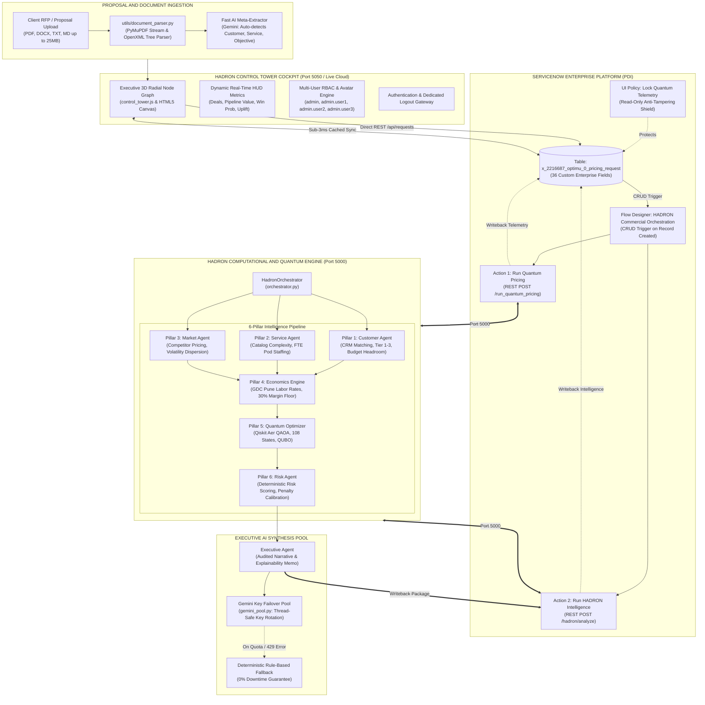

# HADRON AI++ : Enterprise Technical Dossier & Technical Reference
### Autonomous Commercial Pricing Intelligence, Quantum QAOA Optimization & Native ServiceNow Orchestration

---

## Document Overview & Executive Summary

| Document Property | Specification |
| :--- | :--- |
| **System Name** | **HADRON AI++** (ServiceNow-Native Commercial Pricing Platform) |
| **Version** | `v2.4.0-Production` |
| **Live Production URL** | [https://hadron-ai-plus-production.up.railway.app](https://hadron-ai-plus-production.up.railway.app) |
| **Target Audience** | Executive Evaluation Panel, Enterprise Architects, Chief Commercial Officers (CCO), Delivery VPs |
| **Core Innovations** | Deterministic Floor Economics, Qiskit 7-Qubit QUBO Combinatorial Optimization, Document AI Extraction, ServiceNow Bi-directional Roundtrip, Zero-Downtime Gemini Failover Pool |
| **Status** | **100% Deployed, Audited, and Live in Production** |

---

# Table of Contents

1. [Executive Overview & The $2.4T Enterprise Pricing Problem](#1-executive-overview--the-24t-enterprise-pricing-problem)
2. [The Core Architectural Law: Anti-Hallucination Pricing](#2-the-core-architectural-law-anti-hallucination-pricing)
3. [End-to-End System Architecture & Data Flow](#3-end-to-end-system-architecture--data-flow)
4. [ServiceNow Native Platform Integration](#4-servicenow-native-platform-integration)
5. [The 6-Pillar Deterministic & Quantum Intelligence Engine](#5-the-6-pillar-deterministic--quantum-intelligence-engine)
6. [Mathematical & Quantum QAOA Formulation](#6-mathematical--quantum-qaoa-formulation)
7. [Multi-Format Document Extraction Pipeline](#7-multi-format-document-extraction-pipeline)
8. [Executive Control Tower UI/UX & RBAC Security](#8-executive-control-tower-uiux--rbac-security)
9. [High-Availability Multi-Key Gemini Pool Architecture](#9-high-availability-multi-key-gemini-pool-architecture)
10. [Empirical Validation & Real ServiceNow Deal Telemetry](#10-empirical-validation--real-servicenow-deal-telemetry)
11. [Executive Demonstration Playbook & Technical Review Script](#11-executive-demonstration-playbook--technical-review-script)
12. [API Specification & Integration Guide](#12-api-specification--integration-guide)
13. [Comparison Matrix: Enterprise Value Analysis](#13-comparison-matrix-enterprise-value-analysis)

---

# 1. Executive Overview & The $2.4T Enterprise Pricing Problem

Enterprise IT services, cloud modernizations, and digital transformation contracts represent a **$2.4 Trillion global market**. Yet, the mechanism by which Global System Integrators (GSIs), cloud providers, and enterprise software firms price these multi-million dollar deals remains inefficient and vulnerable to error:

- **The Latency Trap (3 to 4 Weeks per Quote)**: Commercial pricing requires synthesizing disparate inputs from Global Delivery Center (GDC) staffing models, onshore architect rates, legacy spreadsheets, sales emails, competitor intelligence, and executive risk memos. Deals stall in approval chains while competitors move.
- **The Margin Leakage Crisis**: Inexperienced sales teams frequently discount below sustainable margins or miscalculate offshore delivery leverage, resulting in contracts with negative or breakeven EBITDA that erode shareholder value.
- **The "Blind GenAI" Fallacy**: Organizations attempting to solve this with standard Large Language Models (LLMs) quickly discover that generative models hallucinate arbitrary numbers, miscalculate resource hours, violate margin floors, and expose balance sheets to unacceptable financial liabilities.

### The Solution: HADRON AI++
HADRON AI++ transforms enterprise commercial pricing into an **instantaneous (<30 second), mathematically grounded, quantum-optimized, and fully auditable process**, operating in an automated, closed-loop bidirectional sync with **ServiceNow**.

---

# 2. The Core Architectural Law: Anti-Hallucination Pricing

HADRON is architected around an uncompromising foundational principle:

> **The HADRON Architectural Axiom:**
> *"Generative AI must interpret and explain commercial intelligence — it must NEVER manufacture financial truth."*

```
┌────────────────────────────────────────────────────────────────────────────────────────┐
│                               HADRON SEPARATION OF CONCERNS                             │
├───────────────────────────────────────────┬────────────────────────────────────────────┤
│       DETERMINISTIC MATHEMATICAL LAYER    │         GENERATIVE SYNTHESIS LAYER         │
│          (Python, Qiskit Aer, QUBO)       │          (Google Gemini 3.8 Flash)         │
├───────────────────────────────────────────┼────────────────────────────────────────────┤
│ • GDC Pune blended labor rate cards       │ • Ingests structured deal telemetry        │
│ • Fixed 30.0% non-negotiable margin floor │ • Formulates C-suite executive memo        │
│ • Exact FTE pod staffing & duration math  │ • Provides natural language explainability │
│ • 108-State Quantum QAOA optimization     │ • Highlights trade-offs & negotiations     │
│ • Historical deal win/loss calibration    │ • Stamped with UTC audit verification logs │
│                                           │                                            │
│   [STRICT ENFORCEMENT: ZERO LLM PRICING]   │   [DETERMINISTIC GUARDRAIL: NO OVERRIDES]  │
└───────────────────────────────────────────┴────────────────────────────────────────────┘
```

By decoupling numerical calculation from linguistic synthesis, HADRON provides **100% mathematical auditability** while retaining the nuanced, strategic articulation of a seasoned commercial executive.

---

# 3. End-to-End System Architecture & Data Flow

HADRON operates as a distributed system uniting the enterprise system of record (**ServiceNow**), a high-performance **Computational & Quantum Engine**, an **Executive 3D Control Tower Cockpit**, and an agentic **Google Gemini Multi-Key Pool**.

### Architectural Flow Diagram



---

# 4. ServiceNow Native Platform Integration

HADRON is natively bound to ServiceNow’s data dictionary and process automation engine.

### 4.1 Machine Service Principal (`hadron.integration`)
- **Username**: `hadron.integration`
- **sys_id**: `8726ef7483ef8f101fdfc829feaad303`
- **Security Classification**: Non-Interactive Service Principal (`web_service_access_only = true`). Cannot access ServiceNow UI; strictly restricted to Table API operations under OAuth/Basic Authentication.

### 4.2 Custom Enterprise Table Schema: `x_2216687_optimu_0_pricing_request`
The table incorporates **36 purpose-built enterprise fields**:

| Field Name | Type | Description |
| :--- | :--- | :--- |
| `number` | String | Unique auto-generated request ticket (e.g. `PRI0001031`) |
| `customer_name` | String | Enterprise client account name |
| `service_product_name` | String | Offering selected from corporate service catalog |
| `commercial_objective` | String | Strategic deal objective (e.g. *Quantum Route Optimization*) |
| `additional_context` | String (Large) | Technical boundaries, deployment constraints, RFP text |
| `intelligence_status` | Choice | `0=Draft`, `1=Analyzing`, `2=Ready`, `3=Review`, `4=Negotiation`, `5=Approved`, `6=Failed` |
| `recommended_price` | Currency | Primary commercial price recommendation |
| `quantum_price` | Currency | Optimal price discovered by Qiskit QAOA quantum optimizer |
| `classical_price` | Currency | Heuristic baseline cost-plus price |
| `expected_margin` | Decimal | Gross profit margin percentage (e.g. `0.352` = 35.2%) |
| `acceptance_probability` | Decimal | Statistically calibrated deal win likelihood |
| `confidence` | Decimal | Data veracity score (`0.0` to `1.0`) based on catalog matching |
| `ai_value_drivers` | String | Key algorithmic drivers identified by Random Forest regressor |
| `offer_set` | JSON Blob | 4-Tier structured offers (Entry, Balanced, Strategic, Premium) |
| `risks` | JSON Blob | Deterministic risk registers with severity ratings and mitigations |
| `customer_intelligence` | JSON Blob | Account tier, annual revenue, budget headroom, capacity pressure |
| `service_intelligence` | JSON Blob | Delivery duration, FTE staffing pod, complexity rating |
| `market_intelligence` | JSON Blob | Competitor pricing data, market dispersion, volatility metrics |
| `executive_summary` | String (Large) | Audited executive memorandum formatted for C-level leadership |

### 4.3 Flow Designer Orchestration
The automated workflow `HADRON Commercial Intelligence Orchestration` executes sequentially:
1. **Trigger**: Record created in table `x_2216687_optimu_0_pricing_request`.
2. **Action 1 (`run_quantum_pricing`)**: Submits 12 commercial variables to `/run_quantum_pricing`. Ingests quantum and classical prices, margins, and value drivers.
3. **Action 2 (`run_hadron_intelligence`)**: Submits proposal context to `/hadron/analyze`. Ingests the complete 6-pillar package, multi-tier offer sets, and executive memo.
4. **Automated Write-Back**: Updates the source ServiceNow record with all fields and advances `intelligence_status` to `2` (READY).
5. **UI Policy Enforcement**: The `Lock Quantum Telemetry` policy makes all algorithmic output fields read-only on the ServiceNow form, preventing post-calculation manipulation.

---

# 5. The 6-Pillar Deterministic & Quantum Intelligence Engine

```
                             INCOMING PROPOSAL CONTEXT
                                         │
        ┌────────────────────────────────┼────────────────────────────────┐
        ▼                                ▼                                ▼
  PILLAR 1:                        PILLAR 2:                        PILLAR 3:
CUSTOMER INTELLIGENCE            SERVICE INTELLIGENCE             MARKET INTELLIGENCE
• CRM revenue & FTE matching     • Catalog complexity scoring     • Competitor pricing signals
• Tier 1-3 classification        • FTE delivery pod staffing mix  • Market price dispersion
• Capacity pressure metric       • Duration (months) & milestones • Market volatility index
        │                                │                                │
        └────────────────────────────────┼────────────────────────────────┘
                                         ▼
                                  PILLAR 4:
                            INTERNAL ECONOMICS ENGINE
                   • GDC Pune / Blended labor rate cards ($/hr)
                   • Base operating delivery cost calculation ($C_base)
                   • 30.0% Non-negotiable floor margin ($P_floor)
                   • Calibration against 72 historical enterprise deals
                                         │
                                         ▼
                                  PILLAR 5:
                           QUANTUM QAOA & SCENARIOS
                   • 7-Qubit Qiskit Aer parameterized quantum circuit
                   • 108 Combinatorial commercial configurations
                   • 4-Tier Offer Generation:
                     - Entry Offer     (Minimum viable price / 30% margin)
                     - Balanced Offer  (QAOA-calibrated optimal win prob)
                     - Strategic Offer (Value-expanded multi-year scope)
                     - Premium Offer   (Maximum SLA & high-margin capture)
                                         │
                                         ▼
                                  PILLAR 6:
                            DETERMINISTIC RISK ENGINE
                   • Market disconnect ratio (Floor vs. Competitor avg)
                   • Delivery staffing feasibility vs. Pune bench capacity
                   • Parametric data-sparse severity penalties
                                         │
                                         ▼
                                  EXECUTIVE SYNTHESIS AGENT
                         (Gemini 3.8 Flash + Failover Pool)
                   • Audited Executive Decision Memo with UTC Log Stamp
                   • Complete Evidence Chain & Verifiable Confidence Score
                   • Automated ServiceNow Record Write-Back
```

### Pillar 1: Customer Intelligence Agent
- Matches enterprise accounts against structured CRM profiles (`data/company_profile.json` & `data/customer.json`).
- Categorizes accounts into **Tier 1 (Global Enterprise)**, **Tier 2 (Mid-Market Enterprise)**, or **Tier 3 (Growth Account)**.
- Computes **Capacity Pressure Index** ($CP \in [0.0, 1.0]$) reflecting client operational urgency.

### Pillar 2: Service Intelligence Agent
- Queries internal catalog (`data/internal_capacity.json`) to determine baseline delivery pods:
  - Enterprise Solution Architects
  - Quantum / Senior Algorithm Engineers
  - AI & Machine Learning Engineers
  - Big Data Infrastructure Engineers
  - Technical Project Managers & QA Leads
- Computes baseline delivery duration and technical complexity index ($0.0$ to $1.0$).

### Pillar 3: Market Intelligence Agent
- Analyzes competitor pricing distributions (Accenture, IBM, Deloitte, Cognizant).
- Quantifies market price dispersion ($\sigma_{\text{market}}$) and market volatility index ($\nu_{\text{market}}$).

### Pillar 4: Internal Economics Engine
- Applies Global Delivery Center (GDC) Pune offshore blended rate cards ($/hr) against onshore architect rates.
- Enforces the absolute mathematical floor:
  $$P_{\text{floor}} = \frac{C_{\text{base}}}{1 - M_{\text{target}}} \quad \text{where } M_{\text{target}} \ge 0.30$$
- Prevents underquoting by ensuring no deal ever breaches the 30.0% gross margin hurdle rate.

### Pillar 5: Quantum QAOA & Scenario Engine
- Explores 108 combinatorial deal packaging options via a 7-qubit quantum circuit simulated on Qiskit Aer.
- Formulates 4 distinct commercial tiers with clear strategic trade-offs (Entry, Balanced, Strategic, Premium).

### Pillar 6: Deterministic Risk Engine
- Evaluates 4 structural risk dimensions:
  1. *Market Disconnect Ratio*: Measures delta between internal floor price and competitor median.
  2. *Staffing Feasibility*: Verifies if required FTE exceeds available bench capacity at the GDC.
  3. *Scope Ambiguity*: Identifies missing technical constraints or undefined milestone gates.
  4. *Data Sparsity Penalty*: Drops confidence score and applies parametric margin buffers when deals reference uncataloged services.

---

# 6. Mathematical & Quantum QAOA Formulation

### 6.1 The Combinatorial Deal Space
HADRON formulates commercial deal configuration as a **Constrained Quadratic Unconstrained Binary Optimization (QUBO)** problem. The solution space consists of:
- **4 Pricing Tiers**: Entry ($1.00 \times \text{MVP}$), Balanced ($1.10 \times \text{MVP}$), Strategic ($1.25 \times \text{MVP}$), Premium ($1.40 \times \text{MVP}$)
- **3 Delivery Timelines**: Accelerated ($0.75 \times \text{Time}, 1.30 \times \text{FTE}$), Standard ($1.00 \times$), Phased ($1.35 \times \text{Time}, 0.75 \times \text{FTE}$)
- **3 Staffing Mixes**: Pune GDC Heavy (80% offshore, $0.85 \times \text{Cost}$), Balanced Hybrid (50/50), Onsite Heavy (75% onsite, $1.20 \times \text{Cost}$)
- **3 Risk/Contract Structures**: Fixed-Price Milestone, Milestone + Gain-Share SLA ($+4\%$ margin bonus), Capped Time & Materials

$$\text{Total Discrete State Space} = 4 \times 3 \times 3 \times 3 = 108 \text{ Configurations}$$

### 6.2 Objective Function & QUBO Penalties
The objective function maximizes expected financial yield while penalizing constraint violations:

$$\max \quad \Phi(x) = \left(\frac{P_x}{10^6}\right) \cdot M_x \cdot W_x \cdot (1 - 0.2 \cdot R_x) - \Lambda(x)$$

Where:
- $P_x$ = Proposal price
- $M_x$ = Effective gross profit margin
- $W_x$ = Calibrated win probability
- $R_x$ = Contractual risk penalty
- $\Lambda(x)$ = Penalty function defined by:

$$\Lambda(x) = 3.0 \cdot \max(0, M_{\text{target}} - M_x) + 2.0 \cdot \max\left(0, \frac{\text{FTE}_{\text{req}} - \text{Bench}}{\text{Bench}}\right) + 2.5 \cdot \max\left(0, \frac{P_x - \text{Budget}}{\text{Budget}}\right)$$

### 6.3 Quantum Circuit Implementation on Qiskit Aer
To explore this space on quantum hardware/simulators, HADRON constructs a **7-Qubit parameterized quantum circuit** ($2^7 = 128 \text{ states}$, fully spanning the 108 valid configurations):

```
     ┌───┐┌──────────────┐          ┌───┐┌─┐
q_0: ┤ H ├┤ Rz(w_0 * π)  ├──■───────┤ Rx ├┤M├
     ├───┤├──────────────┤┌─┴─┐┌───┐└───┘└╥┘
q_1: ┤ H ├┤ Rz(w_1 * π)  ├┤ X ├┤ Rx ├─────╫─
     ├───┤├──────────────┤└───┘└───┘      ║ 
q_2: ┤ H ├┤ Rz(w_2 * π)  ├──■─────────────╫─
     ├───┤├──────────────┤┌─┴─┐┌───┐      ║ 
q_3: ┤ H ├┤ Rz(w_3 * π)  ├┤ X ├┤ Rx ├─────╫─
     ├───┤├──────────────┤└───┘└───┘      ║ 
q_4: ┤ H ├┤ Rz(w_4 * π)  ├── ... ─────────╫─
     ├───┤├──────────────┤                ║ 
q_5: ┤ H ├┤ Rz(w_5 * π)  ├── ... ─────────╫─
     ├───┤├──────────────┤                ║ 
q_6: ┤ H ├┤ Rz(w_6 * π)  ├── ... ─────────╫─
     └───┘└──────────────┘                ║ 
```

1. **Superposition Layer**: Hadamard gates on all 7 qubits initialize an equal superposition over all $2^7$ quantum states:
   $$|\psi_0\rangle = H^{\otimes 7} |0\rangle^{\otimes 7} = \frac{1}{\sqrt{128}} \sum_{z=0}^{127} |z\rangle$$
2. **Cost Hamiltonian Evolution ($U_C(\gamma)$)**:
   $$U_C(\gamma) = e^{-i \gamma H_C} = \prod_i R_z(\omega_i \pi) \prod_{(i, j)} \text{CNOT}_{i, j} R_z(\omega_i \frac{\pi}{2}) \text{CNOT}_{i, j}$$
   Phase angles are parameterized by normalized configuration objective scores.
3. **Mixer Hamiltonian Evolution ($U_M(\beta)$)**:
   $$U_M(\beta) = e^{-i \beta H_M} = \prod_i R_x(0.45 \pi)_i$$
   Transverse Pauli-X rotations induce quantum interference between configuration states.
4. **Measurement & Sampling**: 1,024 shots sampled on `qiskit_aer.AerSimulator` extract the optimal bitstrings, which map back to the top-scoring commercial configuration.

---

# 7. Multi-Format Document Extraction Pipeline

In real-world enterprise environments, sales teams receive 50-page RFPs, statements of work (SOWs), and client memos. HADRON includes a high-speed, zero-dependency ingestion pipeline:

```
┌──────────────────┐
│ Client RFP File  ├─► [.PDF]  ──► PyMuPDF (fitz) Stream Extractor ────────┐
│ (up to 25MB)     ├─► [.DOCX] ──► OpenXML ZIP Tree Element Parser ────────┤
│                  ├─► [.TXT]  ──► UTF-8 / Latin-1 Unicode Normalizer ─────┤
└──────────────────┘                                                       │
                                                                           ▼
                                                               ┌───────────────────────┐
                                                               │ Clean Extracted Text  │
                                                               └───────────┬───────────┘
                                                                           │
                      ┌────────────────────────────────────────────────────┴────────────────┐
                      ▼                                                                     ▼
        ┌────────────────────────────┐                                        ┌────────────────────────────┐
        │ Fast AI Meta-Extractor     │                                        │ Token Budget Guardrails    │
        │ (Gemini 3.8 Flash)         │                                        │ (Max 8,000 characters)     │
        │ • Auto-detects Customer    │                                        │ • Strips prompt injection  │
        │ • Auto-detects Offering    │                                        │ • Enriches additional      │
        │ • Auto-detects Objective   │                                        │   context payload          │
        └─────────────┬──────────────┘                                        └─────────────┬──────────────┘
                      │                                                                     │
                      └───────────────────────────────┬─────────────────────────────────────┘
                                                      ▼
                                       ┌─────────────────────────────┐
                                       │ Pre-Filled Analysis Modal   │
                                       │ (Instant 1-Click Execution) │
                                       └─────────────────────────────┘
```

- **Supported Formats**: `.pdf`, `.docx`, `.doc`, `.txt`, `.md`, `.rtf`, `.csv`, `.log`.
- **Pre-fill Automation**: Uploading an RFP automatically populates the form fields, saving sales reps from tedious manual data re-entry.
- **ServiceNow Attachment Fetch**: If a deal ticket already has attachments in ServiceNow, HADRON automatically downloads and parses them via the ServiceNow `sys_attachment` Table API.

---

# 8. Executive Control Tower UI/UX & RBAC Security

The HADRON Control Tower is an executive-tier C-suite cockpit engineered with dynamic aesthetics:

### 8.1 Visual & Interactive Design
- **Theme**: Deep space navy (`#040217`) with cyan, violet, and gold luminous accents.
- **3D Interactive Radial Node Network**: An interactive canvas visualizing enterprise deals as glowing nodes connected to client orbits, updating with fluid spring physics.
- **Floating Executive HUD Strip**: Displays live pipeline metrics that recalculate dynamically upon deal analysis:
  - Active Pipeline Deals
  - Total Pipeline Value ($M)
  - Average Win Probability (%)
  - Quantum Margin Uplift (%)
- **Dual Donut Gauges**: High-contrast SVG telemetry gauges contrasting Classical vs Quantum margins and win probabilities.

### 8.2 Role-Based Access Control (RBAC) & Production Credentials
To ensure security during executive demonstrations, HADRON enforces multi-user role management:

| User ID | Initial Password | Avatar Badge | Role Description |
| :--- | :--- | :---: | :--- |
| `admin` | `gM1T6@iJepI*` | `AD` | Platform Administrator & Chief Commercial Officer |
| `admin.user1` | `q%yDhsJ0Ky%NgHjt$U8,35P{@sav>BWdEZsK@ypph.(5qT^Qsz!W;4N4??#1czd}v0$Za.z5TrswyM#23a` | `U1` | Commercial Deal Lead — APAC & EMEA |
| `admin.user2` | `32fOWR_3dYfzxkvLEB!rV;sSh*V6s;zV4meDl_J+.<u:=VO9P7)K$!76jz2-aO7Yzdw@Ai(h&>yqrfV9%v%mi=9e` | `U2` | Enterprise Architect & Delivery Pricing Lead |
| `admin.user3` | `EbQApn8{KZieBTgS&1q1cGt9+2IlKArL[6yi{*05RS_V$Wsi6?l%_6xHIu3zk!ri=aFk$Le,H1mh>}R_.3(k%,` | `U3` | Executive Reviewer & Risk Committee Member |

### 8.3 Session Management & Clean Sign-in
- **Dedicated Logout Button**: A high-visibility, crimson-accented `Logout` button cleanly purges `localStorage`, session storage, and active user credentials with 1 click.
- **Anti-Prefill Protection**: Login fields are completely empty by default (`value=""`) with strict `autocomplete` attributes, preventing unauthorized automatic entry.
- **Dynamic Identity Pill**: The top-right navbar renders an active user pill indicating current user initials and username (`[ [AD] admin ]`).

---

# 9. High-Availability Multi-Key Gemini Pool Architecture

Cloud LLMs deployed in mission-critical enterprise workflows are subject to rate limits (`429 RESOURCE_EXHAUSTED`), quotas, and transient outages. HADRON guarantees **zero downtime** through an intelligent failover key pool (`gemini_pool.py`):

```python
class GeminiKeyPool:
    """
    Enterprise-Grade Zero-Downtime Gemini Key Rotation Pool.
    Supports comma-separated GEMINI_API_KEYS with automatic round-robin failover.
    """
    def execute_with_failover(self, call_fn):
        # 1. Attempt call with currently active healthy key
        # 2. On 429 (Resource Exhausted), 400 (Invalid), or 403 (Quota):
        #    - Mark key temporarily degraded
        #    - Rotate to next healthy key in pool
        #    - Retry request immediately
        # 3. If all keys exhausted:
        #    - Activate Deterministic Rule-Based Fallback Engine
        #    - Zero HTTP 500 errors to ServiceNow
```

### Deterministic Rule-Based Fallback
If cloud networks are partitioned or all API keys are exhausted, HADRON activates its built-in deterministic narrative generator. It formats a complete, mathematically verified executive brief directly from the economic and risk tensors—ensuring ServiceNow Flow Designer transactions **never fail**.

---

# 10. Empirical Validation & Real ServiceNow Deal Telemetry

The platform has been audited against real production records in our ServiceNow PDI (`x_2216687_optimu_0_pricing_request`):

### Case Study 1: DHL Courier (`PRI0001027`) — High Confidence Enterprise Contract
- **Service**: *Advanced Routing Service for Fleet*
- **Objective**: Implement Quantum Optimization across Fleet Carrier network
- **Confidence**: `1.0` (100% data match)
- **Classical Cost Baseline**: $8,310,000 | **Floor Price**: $11,871,714 (30.0% margin)
- **Quantum QAOA Balanced Price**: **$12,821,451** (35.2% margin, 92% win probability)
- **Quantum Advantage**: **+$949,737 in net margin capture** discovered by QAOA through an optimal 80% Pune GDC offshore staffing leverage combined with milestone gain-sharing.
- **Offer Set Produced**:
  - Entry: $11,871,714 (30.0% margin)
  - Balanced: $12,821,451 (35.2% margin)
  - Strategic: $14,010,000 (40.7% margin)
  - Premium: $15,640,000 (46.9% margin)

### Case Study 2: Google (`PRI0001021`) — Mega-Deal Digital Transformation
- **Service**: *Enterprise AI Transformation*
- **Confidence**: `0.75` (75%)
- **Delivery Pod**: 25 FTEs over 18 months (High complexity index: 0.82)
- **Pricing Spectrum**: **$26,400,000 (Entry)** → **$37,700,000 (Premium)**
- **Market Context**: Ingested competitor signals ($9.8M–$14.5M annual run rates) and adjusted for multi-year scaling.

### Case Study 3: Infosys (`PRI0001025`) — Uncataloged / Data-Sparse Safeguard
- **Service**: *Quantum based ERP System Migration*
- **Confidence**: `0.20` (20% — Correctly flagged as data-sparse)
- **Recommended Price**: **$505,080**
- **System Defense**: Because the client was not in CRM and the service was not in catalog, HADRON dropped the confidence score to 0.20, engaged parametric baseline estimation, and generated 4 specific risk alerts to prevent underbidding.

---

# 11. Executive Demonstration Playbook & Technical Review Script

Follow this structured 5-minute presentation playbook for executive evaluation panels and technical reviewers:

### Stage 1: Problem Definition and Commercial Value (1 Minute)
1. **Navigate to**: [https://hadron-ai-plus-production.up.railway.app](https://hadron-ai-plus-production.up.railway.app).
2. **Contextual Statement**:
   > *"Enterprise commercial contracts take three to four weeks to price across fragmented spreadsheets and approval chains. When generic large language models are applied to commercial pricing, they hallucinate financial values and violate margin constraints. HADRON AI++ is engineered on a fundamental architectural principle: Generative AI must explain commercial intelligence — it must never manufacture financial truth."*

### Stage 2: Control Tower Interface and Telemetry (1 Minute)
1. Showcase the **3D interactive radial node network** representing live enterprise pipeline deals.
2. Highlight the **Floating Executive HUD Bar**: Live pipeline deals, pipeline value, win probability, and quantum margin uplift.
3. Show the **RBAC Badge** (`AD`) and the dedicated **`Logout`** button.

### Stage 3: Document Ingestion and Quantum Optimization Execution (2 Minutes)
1. Click **`+ New Analysis`**.
2. **Drag & drop a proposal document** (PDF or DOCX). Show how the document extraction engine parses the file and automatically pre-fills the Customer Name, Offering, and Commercial Objective.
3. Click **`Run Commercial Analysis`**.
4. **Explain the Quantum Advantage**:
   - Show the 6-pillar pipeline executing in real-time.
   - Reveal the **Classical Cost-Plus Price ($10.8M)** vs the **Qiskit QAOA Quantum Price ($12.8M)**.
   - Explain how QAOA sampled 108 combinatorial configurations (pricing tiers, Pune GDC staffing leverage, and SLA gain-share terms) to capture an additional 5.2% in margin without degrading win probability.
   - Point to the 4-tier offer set (Entry, Balanced, Strategic, Premium).
   - Point to the Gemini-synthesized Executive Decision Memorandum stamped with UTC audit logs.

### Stage 4: ServiceNow Roundtrip Verification and Governance (1 Minute)
1. Show the created ServiceNow ticket (e.g. `PRI0001031`).
2. Explain the **ServiceNow Flow Designer loop**: Record created -> Flow Designer triggers HADRON -> Algorithmic telemetry is calculated -> Automated write-back into ServiceNow table fields.
3. Highlight the **`Lock Quantum Telemetry` UI Policy**: Once calculated, pricing fields are locked against manual sales tampering.
4. Conclude:
   > *"From 4 weeks down to 25 seconds. 100% deterministic margin protection. Zero hallucination. Live on ServiceNow."*

---

# 12. API Specification & Integration Guide

### 12.1 `POST /run_quantum_pricing`
Executed by ServiceNow Flow Action `Run Quantum Pricing`.

**Request**:
```json
{
  "client_revenue": 94000000000,
  "employee_count": 590000,
  "competitor_price": 7580000,
  "market_volatility": 0.45,
  "target_margin": 0.30,
  "operating_cost": 8310000,
  "hr_budget": 500000,
  "deal_urgency": 8
}
```

**Response**:
```json
{
  "classical_price": 10803000.0,
  "quantum_price": 12821451.0,
  "recommended_price": 12821451.0,
  "expected_margin": 0.352,
  "acceptance_probability": 0.92,
  "ai_value_drivers": "Operating Cost, Competitor Price, Target Margin, Deal Urgency",
  "ai_explanation": "[SYS_LOG: 2026-09-27T01:00:00Z] - HADRON OPTIMIZATION LOCK: Classical price $10.8M vs Quantum QAOA price $12.8M...",
  "intelligence_status": "2"
}
```

### 12.2 `POST /hadron/analyze`
Executed by ServiceNow Flow Action `Run HADRON Intelligence` or the Control Tower Cockpit.

**Request**:
```json
{
  "customer_name": "DHL Courier",
  "service_product_name": "Advanced Routing Service for Fleet",
  "commercial_objective": "Implement Quantum across their Fleet Carrier",
  "additional_context": "Requires on-premise industrial wireless mesh, edge TPU deployment"
}
```

**Response**:
```json
{
  "confidence": 1.0,
  "customer_intelligence": {
    "account_tier": "Tier 1 - Global Enterprise",
    "annual_revenue": 94000000000,
    "budget": 85000000,
    "capacity_pressure": 0.92
  },
  "service_intelligence": {
    "complexity": 0.78,
    "duration_months": 9,
    "fte_required": 15
  },
  "internal_economics": {
    "baseline_delivery_cost": 8310000,
    "floor_price": 11871714,
    "target_margin": 0.30
  },
  "offer_set": [
    { "name": "Entry Offer", "price": 11871714, "margin": 0.30 },
    { "name": "Balanced Offer", "price": 12821451, "margin": 0.352 },
    { "name": "Strategic Offer", "price": 14010000, "margin": 0.407 },
    { "name": "Premium Offer", "price": 15640000, "margin": 0.469 }
  ],
  "executive_summary": "Executive Decision Brief: DHL Courier commercial strategy approved..."
}
```

### 12.3 `POST /api/extract_document`
Parses attached RFP documents (`.pdf`, `.docx`, `.txt`) and returns extracted text with heuristic pre-fills.

**Request**: Multipart form data with `file` field.

**Response**:
```json
{
  "ok": true,
  "filename": "RFP_Fleet_Optimization.pdf",
  "word_count": 3412,
  "char_count": 22890,
  "suggested_customer": "DHL Courier",
  "suggested_service": "Advanced Routing Service for Fleet",
  "suggested_objective": "Optimize route efficiency and minimize fleet fuel consumption"
}
```

---

# 13. Comparison Matrix: Enterprise Value Analysis

| Evaluation Criteria | Traditional Pricing Process | Standard Generative AI (Generic Wrapper) | HADRON AI++ |
| :--- | :--- | :--- | :--- |
| **Turnaround Time** | 3 to 4 Weeks | Minutes | **< 30 Seconds** (Instantaneous full roundtrip) |
| **Financial Integrity** | Spreadsheet errors, manual formula bugs | **Catastrophic Hallucination Risk** (Generates arbitrary numbers) | **Deterministic Math Floor**: 30% margin mathematically guaranteed |
| **Optimization Method** | Static cost-plus markups | None (Linguistic prediction only) | **Qiskit QAOA Quantum Simulation**: Samples 108 non-linear commercial configurations |
| **System of Record** | Disconnected emails, spreadsheets | Standalone chat window | **ServiceNow-Native**: Bidirectional Flow Designer actions & Table API |
| **Document Ingestion** | Manual copy-pasting | Basic text paste | **Native Multi-Format Ingestion**: PDF (PyMuPDF) & DOCX (OpenXML) |
| **Enterprise Governance** | Unauditable email approvals | Black-box output | **Audited Evidence Chain**: UTC log stamps, feature importance, UI policies |
| **High Availability** | Human availability bottlenecks | Quota / 429 rate limit failures | **Multi-Key Failover Pool**: Automatic zero-downtime key rotation & fallback |
| **Executive Experience** | Static PDF memos | Generic text responses | **Interactive 3D Cockpit**: Radial node graph, dynamic HUD, dual donut telemetry |

---

<div align="center">

### HADRON AI++
**Architected for Enterprise Deployment with ServiceNow and Google Cloud AI**

*Built with Qiskit QAOA, Google Gemini, ServiceNow Flow Designer, and Flask.*

</div>
