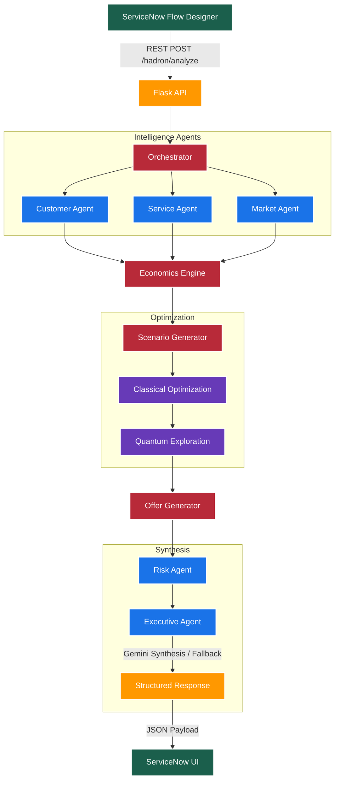

<div align="center">
  
  <h1 align="center">HADRON AI++</h1>
  <h3>ServiceNow-Native Commercial Intelligence & Pricing Decision Engine</h3>

  <p align="center">
    <a href="https://python.org"></a>
    <a href="https://qiskit.org"></a>
    <a href="https://flask.palletsprojects.com/"></a>
    <a href="https://www.servicenow.com/"></a>
  </p>
</div>

<br>

> **HADRON AI++** is an advanced, deterministic commercial intelligence layer designed to seamlessly integrate with ServiceNow. It orchestrates enterprise intelligence, calculates risk and economics deterministically, optimizes pricing scenarios both classically and with quantum exploration, and leverages Generative AI (Gemini) to synthesize an explainable executive decision brief.

<br>

## 🚀 Key Capabilities

- **🧠 Multi-Agent Orchestration**: Specialized agents for Customer, Service, Market, Risk, and Executive Synthesis.
- **🛡️ Deterministic Risk & Economics**: Calculations are anchored in ground truth; the LLM interprets but never invents risks or pricing.
- **⚛️ Quantum-Ready Optimization**: Combines classical commercial logic with Qiskit-based quantum scenario exploration.
- **📈 Resilient Architecture**: Graceful fallbacks, automated retry logic, and deterministic executive summaries guarantee uptime even during LLM outages.

---

## 🏛️ Architecture

HADRON operates as a comprehensive intelligence pipeline, moving from raw signals to a structured executive decision brief.



---

## ⚙️ Prerequisites

Ensure you have the following installed before running the project:

### 🍎 Mac / Linux
- **Python 3.9+** (`brew install python` or `apt install python3`)
- **Git** (`brew install git`)
- **Ngrok** (`brew install ngrok/ngrok/ngrok`) for exposing the local server.

### 🪟 Windows
- **Python 3.9+** (Download from [python.org](https://www.python.org/downloads/))
- **Git Bash** or **PowerShell**
- **Ngrok** (Download from [ngrok.com](https://ngrok.com/download))

> [!IMPORTANT]
> You will also need a **Google Gemini API Key** for the Executive Agent to function fully, though the system will fall back to a deterministic model if a key is unavailable.

---

## 🛠️ Setup & Installation

**1. Clone the repository**
```bash
git clone https://github.com/jayanthoffl/hadron-ai-plus.git
cd hadron-ai-plus
```

**2. Create a Virtual Environment**
- **Mac/Linux:**
  ```bash
  python3 -m venv venv
  source venv/bin/activate
  ```
- **Windows:**
  ```powershell
  python -m venv venv
  .\venv\Scripts\activate
  ```

**3. Install Dependencies**
```bash
pip install -r requirements.txt
```

**4. Environment Variables**
Create a `.env` file in the root directory:
```env
GEMINI_API_KEY=your_google_gemini_api_key
```
*(Optionally configure models inside `config.py`)*

---

## 🏃 Running the Service

HADRON operates as a Flask API. Start the server locally:

```bash
python app.py
```
*The service will start on `http://127.0.0.1:5000`*

To expose this to ServiceNow, start an ngrok tunnel in a new terminal:
```bash
ngrok http 5000
```
Copy the generated Forwarding URL (e.g., `https://<hash>.ngrok-free.app`).

---

## 🔗 ServiceNow Integration

HADRON is designed to be invoked directly from a **ServiceNow Flow Designer Action**.

### 1. Configure the REST Message
Point the REST step to your active ngrok URL:
`POST https://<your-ngrok-url>/hadron/analyze`

### 2. Request Payload
Send a JSON payload containing the deal context:
```json
{
  "customer_name": "Acme Corporation",
  "service_product_name": "Enterprise AI Transformation",
  "commercial_objective": "Establish a strategic foothold",
  "additional_context": "Customer is evaluating multiple transformation partners.",
  "record_sys_id": "PR1001016"
}
```

### 3. Response Architecture
HADRON will synchronously return a highly structured JSON intelligence package:
- `executive_summary`: Synthesized commercial brief.
- `internal_economics`: Cost, required margins, capacity.
- `offer_set`: Four commercial alternatives (Entry, Balanced, Strategic, Premium).
- `risks`: Array of identified triggers (e.g., `PRICE_DISCONNECT`, `DELIVERY_COMPLEXITY`).
- `confidence`: Calculated evidence reliability.

> [!TIP]
> The ServiceNow action should parse this JSON and map it to fields on a custom `x_hadron_analysis` table for presentation in the ServiceNow UI.

<div align="center">
  <p><i>Built with precision for the enterprise.</i></p>
</div>
