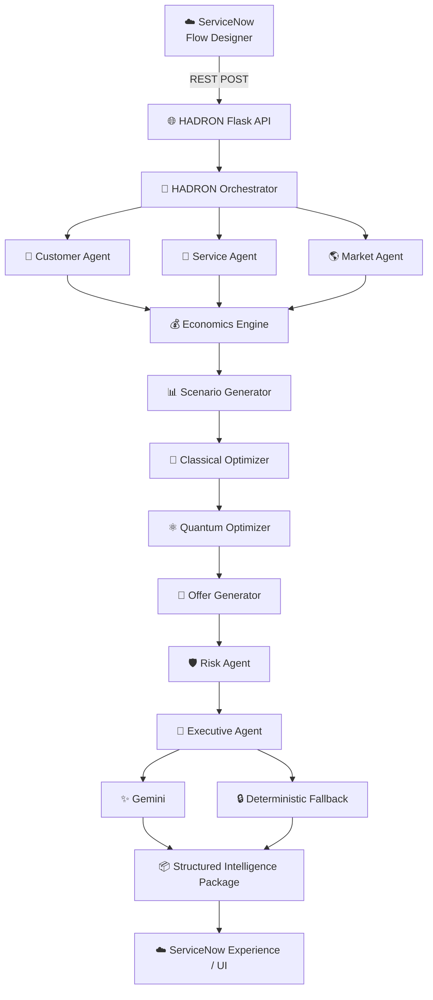
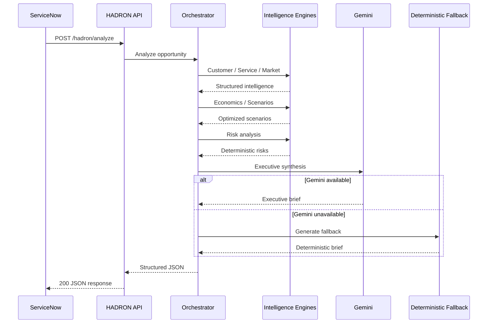
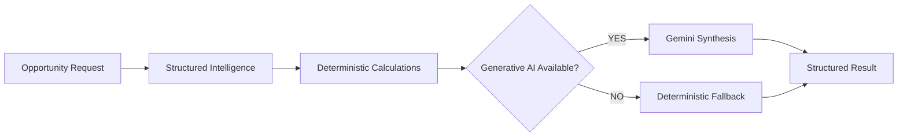

<div align="center">

# ⚛️ HADRON AI++

### ServiceNow-Native Commercial Intelligence & Pricing Decision Engine

<p>
  <strong>From opportunity context → intelligence → economics → scenarios → risk → executive decision.</strong>
</p>

<br/>

<a href="https://www.python.org/">
  
</a>
<a href="https://qiskit.org/">
  
</a>
<a href="https://flask.palletsprojects.com/">
  
</a>
<a href="https://www.servicenow.com/">
  
</a>
<a href="https://ai.google.dev/">
  
</a>

<br/><br/>


<br/>

### 🚀 Turning commercial complexity into structured decisions.

<br/>

[Architecture](#-architecture) •
[How It Works](#-how-hadron-works) •
[Business Value](#-business-chapter) •
[Service & Product Intelligence](#-service--product-intelligence) •
[Setup](#-setup) •
[ServiceNow](#-servicenow-integration) •
[API](#-api) •
[Roadmap](#-roadmap)

</div>

---

# 🧬 What is HADRON?

**HADRON AI++** is a commercial intelligence and pricing decision engine designed to operate alongside **ServiceNow**.

It takes structured opportunity context and transforms it into a multi-layer decision package containing:

- Customer intelligence
- Service / product intelligence
- Market intelligence
- Internal economics
- Pricing scenarios
- Classical optimization
- Quantum exploration
- Deterministic risk intelligence
- Commercial offer alternatives
- Executive synthesis
- Evidence
- Confidence
- Fallback intelligence when generative AI is unavailable

The central principle is simple:

> **Generative AI should interpret commercial intelligence — not manufacture the commercial truth.**

HADRON therefore separates deterministic computation from generative synthesis.

---

# 🎯 The Problem HADRON Solves

Enterprise commercial decisions frequently span multiple systems, people and analytical processes.

A typical opportunity may require understanding:

```text
Customer
   ↓
Business Context
   ↓
Service / Product
   ↓
Market
   ↓
Competition
   ↓
Cost
   ↓
Margin
   ↓
Pricing
   ↓
Risk
   ↓
Commercial Options
   ↓
Executive Decision
```

In many environments, these layers are disconnected.

A sales team may have the customer context.

A delivery team may understand complexity.

Finance may understand cost.

Pricing may understand margins.

Market teams may understand competitors.

Leadership may receive all of this as disconnected documents, spreadsheets,
messages and meetings.

HADRON is designed to create a single computational pipeline.

---

# ⚡ HADRON in One Sentence

> **HADRON converts opportunity context into explainable commercial intelligence and structured pricing alternatives while keeping economics and risk deterministic.**

---

# 🏛️ Architecture



---

# 🔬 Architectural Philosophy

HADRON is deliberately split into two major computational domains.

## Domain 1 — Deterministic Intelligence

This layer is responsible for facts and calculations.

```text
Customer data
Service data
Market signals
Economics
Pricing
Optimization
Risk triggers
```

These should remain reproducible.

---

## Domain 2 — Generative Intelligence

The Executive Agent receives the structured intelligence and produces a human-readable executive brief.

```text
Structured intelligence
        ↓
       Gemini
        ↓
Executive synthesis
```

If Gemini is unavailable:

```text
Structured intelligence
        ↓
Deterministic fallback
        ↓
Executive response
```

This means an external LLM outage should not automatically destroy the commercial workflow.

---

# 🧠 Core Design Principle

```text
             ┌─────────────────────────────┐
             │       GENERATIVE AI         │
             │                             │
             │ Executive interpretation    │
             │ Narrative synthesis         │
             │ Evidence explanation        │
             └──────────────┬──────────────┘
                            │
                            │ interprets
                            ▼
             ┌─────────────────────────────┐
             │   DETERMINISTIC ENGINE      │
             │                             │
             │ Economics                   │
             │ Risk                        │
             │ Pricing                     │
             │ Optimization                │
             │ Scenario generation         │
             └─────────────────────────────┘
```

### Why?

Because the system should not ask an LLM:

> "What should our minimum viable price be?"

It should calculate the answer using the economics engine.

The LLM can then explain what that number means.

---

# 🔄 How HADRON Works

The complete pipeline is:

```text
1. Opportunity enters ServiceNow
              ↓
2. ServiceNow sends structured request
              ↓
3. Flask API validates request
              ↓
4. Orchestrator starts intelligence pipeline
              ↓
5. Customer intelligence
              ↓
6. Service / product intelligence
              ↓
7. Market / competitive intelligence
              ↓
8. Internal economics
              ↓
9. Commercial scenarios
              ↓
10. Classical optimization
              ↓
11. Quantum exploration
              ↓
12. Offer generation
              ↓
13. Deterministic risk analysis
              ↓
14. Executive synthesis
              ↓
15. Gemini OR deterministic fallback
              ↓
16. Structured JSON response
              ↓
17. ServiceNow
```

---

# 🧠 1. Customer Intelligence

The Customer Agent is responsible for understanding the commercial context surrounding the customer.

The architecture allows customer intelligence to evolve from static/demo data into dynamic enterprise intelligence.

Potential future inputs include:

* Customer profile
* Industry
* Existing relationship
* Installed products
* Existing contracts
* Historical opportunities
* Strategic account information
* Commercial objectives
* Business transformation context
* Internal customer signals

The key output is a structured customer intelligence object.

Example:

```json
{
  "customer_name": "Acme Corporation",
  "industry": "Enterprise",
  "relationship": "Strategic",
  "commercial_context": "...",
  "signals": []
}
```

---

# 🧩 2. Service & Product Intelligence

The Service Agent analyzes the service or product being commercialized.

This layer is important because pricing cannot be separated from delivery complexity.

HADRON can reason about signals such as:

```text
Service complexity
Delivery requirements
Dependencies
Implementation effort
Capabilities
Scope
Delivery model
Commercial structure
```

For example:

```json
{
  "service_product_name": "Enterprise AI Transformation",
  "complexity": 0.82
}
```

The important principle is:

> **A high-complexity service should not be treated as an ordinary commodity price point.**

---

# 🌎 3. Market Intelligence

The Market Agent provides external commercial signals.

The architecture is designed to support:

* Competitor signals
* Market reference pricing
* Competitive positioning
* Market ranges
* External research
* Industry signals
* Public competitive information

Example market signals:

```json
{
  "competitor_signals": [
    "Competitor A: $14,500,000",
    "Competitor B: $9,800,000",
    "Competitor C: $12,700,000"
  ]
}
```

HADRON can normalize these signals into usable market references.

For example:

```text
Observed market reference
            ↓
       $12.33M
```

---

# 💰 4. Economics Engine

The Economics Engine is one of the most important deterministic components.

It calculates internal commercial economics.

Conceptually:

```text
Revenue
   ↓
Cost
   ↓
Margin
   ↓
Required economics
   ↓
Minimum viable price
```

The engine should remain independent from Gemini.

That means:

> **LLM availability does not determine financial calculations.**

---

# 📊 5. Scenario Generation

Instead of producing a single price, HADRON generates multiple commercial scenarios.

The conceptual model is:

```text
                 Opportunity
                     │
          ┌──────────┼──────────┐
          ▼          ▼          ▼
        Entry     Balanced   Strategic
          │          │          │
          └──────────┼──────────┘
                     ▼
                  Premium
```

The current offer architecture supports alternatives such as:

* Entry
* Balanced
* Strategic
* Premium

These alternatives are deliberately not collapsed into one answer.

---

# 📐 6. Classical Optimization

The classical optimizer evaluates the generated scenarios.

It provides a deterministic computational layer before quantum exploration.

Conceptually:

```text
Scenario Set
     ↓
Constraint Evaluation
     ↓
Commercial Optimization
     ↓
Refined Scenario Set
```

The purpose is to make the commercial alternatives computationally explicit.

---

# ⚛️ 7. Quantum Exploration

HADRON includes a quantum optimization layer implemented with Qiskit.

The role of this component is currently:

> **Quantum exploration of commercial scenario optimization.**

It should not be interpreted as claiming quantum advantage over classical optimization.

The architecture intentionally allows experimentation with quantum approaches while maintaining a classical baseline.

```text
                 Scenario Set
                     │
             ┌───────┴────────┐
             ▼                ▼
      Classical Layer    Quantum Layer
             │                │
             └───────┬────────┘
                     ▼
              Commercial Options
```

This provides a foundation for future experimentation with:

* Constraint optimization
* QUBO formulations
* Combinatorial pricing problems
* Scenario selection
* Portfolio optimization
* Resource allocation

---

# 💼 8. Offer Generator

The Offer Generator converts optimized scenarios into commercially interpretable offers.

An offer can contain concepts such as:

```text
Price
Margin
Commercial posture
Scenario
Trade-offs
Expected implications
```

The system deliberately maintains multiple alternatives.

This allows an executive to understand:

```text
"What happens if we optimize for..."

          Economics
             vs
       Market position
             vs
      Strategic entry
             vs
        Premium value
```

rather than receiving a black-box single answer.

---

# 🛡️ 9. Risk Intelligence

Risk analysis is deterministic.

This is critical.

The Risk Agent can identify specific risk triggers from the underlying structured data.

Current examples include:

### PRICE_DISCONNECT

When internal economics materially differ from observed market signals.

Example:

```json
{
  "type": "PRICE_DISCONNECT",
  "severity": "HIGH",
  "metric": {
    "internal_floor": 25147058.82,
    "market_reference": 12333333.33,
    "ratio": 2.039
  }
}
```

---

### DELIVERY_COMPLEXITY

When service complexity indicates elevated implementation or execution risk.

Example:

```json
{
  "type": "DELIVERY_COMPLEXITY",
  "severity": "HIGH",
  "metric": {
    "complexity": 0.82
  }
}
```

---

# 🔐 Why Risk Is Deterministic

The LLM should not decide whether a risk exists.

Instead:

```text
Internal economics
       +
Market intelligence
       +
Service complexity
       ↓
Deterministic risk engine
       ↓
Risk triggers
       ↓
Gemini explains them
```

This creates a much stronger architecture than:

```text
Everything → LLM → "Here are some risks"
```

---

# 🧠 10. Executive Intelligence

The Executive Agent sits at the final intelligence layer.

Its responsibility is synthesis.

It receives:

```text
Customer
Service
Market
Economics
Offers
Risks
Commercial objective
Additional context
```

and produces:

```json
{
  "executive_summary": "...",
  "competitive_intelligence": "...",
  "risks": [],
  "evidence": [],
  "confidence": 0.0
}
```

---

# ✨ Gemini Synthesis

When Gemini is available:

```text
Structured Intelligence
          ↓
      Gemini
          ↓
Executive Narrative
```

The model is explicitly instructed:

* Do not invent facts.
* Do not invent competitors.
* Do not invent prices.
* Do not invent customer information.
* Do not invent financial information.
* Preserve deterministic risks.
* Distinguish evidence from assumptions.
* Do not select a single "best" offer.
* Explain trade-offs.

---

# 🔒 Deterministic Fallback

HADRON does not depend entirely on generative AI availability.

If Gemini returns:

```text
429 RESOURCE_EXHAUSTED
```

or:

```text
503 UNAVAILABLE
```

the system can fall back to deterministic executive intelligence.

The architecture becomes:

```text
                 Gemini
                   │
              Available?
              /         \
            YES          NO
             │            │
             ▼            ▼
       AI synthesis   Deterministic
                         fallback
             │            │
             └──────┬─────┘
                    ▼
             Structured result
```

This is especially important for enterprise workflows.

---

# ☁️ ServiceNow Integration

HADRON is designed to be invoked from ServiceNow Flow Designer.

The ServiceNow action sends:

```http
POST /hadron/analyze
```

with:

```json
{
  "customer_name": "Acme Corporation",
  "service_product_name": "Enterprise AI Transformation",
  "commercial_objective": "Establish a strategic foothold while maintaining sustainable economics",
  "additional_context": "Customer is evaluating multiple transformation partners.",
  "record_sys_id": "PR1001016"
}
```

---

# 🔗 ServiceNow → HADRON



---

# 📦 Response Contract

A successful response is structured around:

```json
{
  "executive_summary": "...",
  "customer_intelligence": "...",
  "market_intelligence": "...",
  "service_intelligence": "...",
  "internal_economics": "...",
  "competitive_intelligence": "...",
  "offer_set": [],
  "risks": [],
  "evidence": [],
  "confidence": 0.0,
  "run_id": "PR1001016"
}
```

This makes HADRON suitable for downstream ServiceNow experiences.

---

# 🖥️ ServiceNow Experience

The long-term ServiceNow experience can expose:

```text
┌──────────────────────────────────────────────────────────┐
│                 HADRON COMMERCIAL INTELLIGENCE           │
├──────────────────────────────────────────────────────────┤
│                                                          │
│  CUSTOMER                                                │
│  Acme Corporation                                        │
│                                                          │
│  SERVICE                                                 │
│  Enterprise AI Transformation                            │
│                                                          │
├──────────────────────────────────────────────────────────┤
│                                                          │
│  EXECUTIVE SUMMARY                                       │
│  ─────────────────────────────────────────────────────   │
│  Structured executive intelligence...                    │
│                                                          │
├──────────────────────┬───────────────────────────────────┤
│ INTERNAL ECONOMICS   │ MARKET INTELLIGENCE               │
│                      │                                   │
│ Cost                 │ Competitive signals              │
│ Margin               │ Market reference                 │
│ Minimum viable price │ Market context                   │
│                      │                                   │
├──────────────────────┴───────────────────────────────────┤
│                                                          │
│ COMMERCIAL ALTERNATIVES                                  │
│                                                          │
│ Entry       Balanced       Strategic       Premium       │
│                                                          │
├──────────────────────────────────────────────────────────┤
│                                                          │
│ ⚠ RISK INTELLIGENCE                                      │
│                                                          │
│ PRICE_DISCONNECT                                         │
│ DELIVERY_COMPLEXITY                                      │
│                                                          │
├──────────────────────────────────────────────────────────┤
│                                                          │
│ EVIDENCE & CONFIDENCE                                    │
│                                                          │
└──────────────────────────────────────────────────────────┘
```

---

# 🏢 Business Chapter

HADRON is designed around a simple business problem:

## Commercial decisions should be treated as intelligence problems.

An enterprise opportunity contains several dimensions.

### Customer Dimension

```text
Who is the customer?
What are they trying to achieve?
What is their context?
What is the strategic importance?
```

### Service Dimension

```text
What are we delivering?
How complex is it?
What does delivery require?
What dependencies exist?
```

### Market Dimension

```text
What is happening externally?
What competitive signals exist?
What reference prices exist?
```

### Economics Dimension

```text
What does it cost?
What economics are required?
Where is the internal floor?
```

### Optimization Dimension

```text
What commercial scenarios exist?
How do constraints affect them?
```

### Risk Dimension

```text
Where are the disconnects?
What could threaten the commercial structure?
```

### Executive Dimension

```text
What does all of this mean?
What trade-offs exist?
What evidence supports the conclusion?
```

HADRON brings these dimensions together.

---

# 💼 Business Value Model

```text
                    OPPORTUNITY
                         │
                         ▼
              ┌───────────────────┐
              │ Commercial Context │
              └─────────┬─────────┘
                        │
          ┌─────────────┼─────────────┐
          ▼             ▼             ▼
      Customer       Service        Market
          │             │             │
          └─────────────┼─────────────┘
                        ▼
                   Economics
                        │
                        ▼
                   Scenarios
                        │
              ┌─────────┴─────────┐
              ▼                   ▼
        Optimization          Risk
              │                   │
              └─────────┬─────────┘
                        ▼
                  Executive View
```

---

# 🧩 Service & Product Strengths

HADRON is particularly suited to complex services and transformation-oriented offerings where pricing cannot be determined by a simple catalog lookup.

Examples of applicable service categories include:

* AI transformation
* Enterprise transformation
* Cloud transformation
* Digital transformation
* Data modernization
* Managed services
* Consulting engagements
* Technology implementation
* Complex professional services
* Multi-year strategic engagements

The architecture is especially useful when the commercial decision depends on several variables simultaneously.

---

# 📈 Why Service Complexity Matters

Consider two opportunities:

```text
Opportunity A
────────────────────────
Simple implementation
Low dependency
Low delivery complexity


Opportunity B
────────────────────────
Enterprise transformation
Multiple workstreams
High dependencies
Complex implementation
Strategic stakeholders
```

A pricing engine that only looks at historical prices can miss this distinction.

HADRON introduces service intelligence into the commercial model.

---

# 🧮 Commercial Intelligence Layers

| Layer                  | Responsibility               | Deterministic? | AI Assisted? |
| ---------------------- | ---------------------------- | -------------: | -----------: |
| Customer Intelligence  | Customer context             |            Yes |     Optional |
| Service Intelligence   | Service/product context      |            Yes |     Optional |
| Market Intelligence    | External signals             |            Yes |     Optional |
| Economics              | Cost & pricing economics     |        **Yes** |           No |
| Scenario Generation    | Commercial alternatives      |        **Yes** |           No |
| Classical Optimization | Scenario optimization        |        **Yes** |           No |
| Quantum Exploration    | Optimization experimentation |        **Yes** |           No |
| Risk Intelligence      | Risk triggers                |        **Yes** |           No |
| Executive Synthesis    | Interpretation               |             No |      **Yes** |
| Fallback Synthesis     | Availability protection      |        **Yes** |           No |

---

# 🧱 Project Structure

A conceptual project structure:

```text
hadron-ai-plus/
│
├── agents/
│   ├── customer_agent.py
│   ├── service_agent.py
│   ├── market_agent.py
│   ├── risk_agent.py
│   └── executive_agent.py
│
├── economics/
│   └── engine.py
│
├── optimization/
│   ├── scenarios.py
│   ├── classical.py
│   └── quantum.py
│
├── offers/
│   └── generator.py
│
├── data/
│   ├── customer data
│   ├── service data
│   ├── market data
│   └── economics data
│
├── schemas.py
├── orchestrator.py
├── config.py
├── app.py
├── requirements.txt
├── .env
└── README.md
```

---

# 🔌 API Layer

The Flask application exposes the HADRON endpoint.

```http
POST /hadron/analyze
```

Example:

```bash
curl -X POST http://127.0.0.1:5000/hadron/analyze \
  -H "Content-Type: application/json" \
  -d '{
    "customer_name": "Acme Corporation",
    "service_product_name": "Enterprise AI Transformation",
    "commercial_objective": "Establish a strategic foothold while maintaining sustainable economics",
    "additional_context": "Customer is evaluating multiple transformation partners.",
    "record_sys_id": "PR1001016"
  }'
```

---

# 🛠️ Prerequisites

## Required

* Python 3.10+
* Git
* pip
* Virtual environment
* ServiceNow instance
* ngrok or another secure tunnel for local integration testing

## Optional / Runtime

* Google Gemini API access
* Qiskit
* ServiceNow Flow Designer
* ServiceNow REST integration capability

> **Note:** The development environment previously used Python 3.9. Python 3.10+ is recommended for continued development because Python 3.9 has reached end-of-life and newer Qiskit / Google libraries are moving beyond it.

---

# 🚀 Setup

## 1. Clone

```bash
git clone https://github.com/jayanthoffl/hadron-ai-plus.git

cd hadron-ai-plus
```

---

## 2. Create virtual environment

### macOS / Linux

```bash
python3 -m venv venv

source venv/bin/activate
```

### Windows

```powershell
python -m venv venv

.\venv\Scripts\activate
```

---

# 📦 3. Install dependencies

```bash
pip install -r requirements.txt
```

---

# 🔐 4. Configure environment

Create:

```text
.env
```

Example:

```env
GEMINI_API_KEY=your_google_gemini_api_key

GEMINI_MODEL=your_primary_model

GEMINI_FALLBACK_MODEL=your_fallback_model
```

Keep `.env` out of source control.

---

# ▶️ 5. Start HADRON

```bash
python app.py
```

The development server should expose:

```text
http://127.0.0.1:5000
```

---

# 🧪 6. Test locally

```bash
curl -X POST \
  http://127.0.0.1:5000/hadron/analyze \
  -H "Content-Type: application/json" \
  -d '{
    "customer_name": "Acme Corporation",
    "service_product_name": "Enterprise AI Transformation",
    "commercial_objective": "Establish a strategic foothold while maintaining sustainable economics",
    "additional_context": "Customer is evaluating multiple transformation partners.",
    "record_sys_id": "PR1001016"
  }'
```

---

# 🌐 Exposing HADRON to ServiceNow

For local development:

```bash
ngrok http 5000
```

You will receive a forwarding URL similar to:

```text
https://xxxxxxxx.ngrok-free.app
```

The effective endpoint becomes:

```text
POST https://xxxxxxxx.ngrok-free.app/hadron/analyze
```

---

# ☁️ ServiceNow Configuration

In Flow Designer:

```text
Action
  ↓
REST Step
```

Configure:

### HTTP Method

```text
POST
```

### Base URL

```text
https://<your-ngrok-host>
```

### Resource Path

```text
/hadron/analyze
```

### Header

```text
Content-Type: application/json
```

### Request Body

```json
{
  "customer_name": "<Customer Name>",
  "service_product_name": "<Service / Product Name>",
  "commercial_objective": "<Commercial Objective>",
  "additional_context": "<Additional Context>",
  "record_sys_id": "<Record Sys ID>"
}
```

---

# 🔍 Integration Debugging

If ServiceNow receives:

```text
500
```

inspect the REST step.

Important fields:

```text
Status Code
Response Body
Response Headers
Request Payload
Resource Path
Base URL
```

A particularly useful diagnostic pattern is:

```text
ServiceNow
   ↓
REST Step
   ↓
ngrok
   ↓
Flask
   ↓
Python terminal
```

The Python terminal should show:

```text
POST /hadron/analyze HTTP/1.1
```

For successful execution:

```text
200
```

---

# 🧪 Testing Strategy

HADRON should be tested at multiple levels.

## Level 1 — Python syntax

```bash
python -m py_compile orchestrator.py
```

or:

```bash
python -m py_compile \
  agents/*.py \
  economics/*.py \
  optimization/*.py \
  offers/*.py
```

---

## Level 2 — Local API

```bash
curl ...
```

---

## Level 3 — Failure simulation

Test:

```text
Unknown customer
Unknown service
Missing market data
Missing economics
Gemini 429
Gemini 503
Invalid JSON
Missing request fields
Zero-value economics
```

---

## Level 4 — ServiceNow

```text
ServiceNow
   ↓
REST
   ↓
ngrok
   ↓
HADRON
   ↓
Response mapping
```

---

# 🛡️ Resilience Architecture

HADRON is designed around graceful degradation.



This means:

### Gemini available

```text
Rich executive narrative
```

### Gemini unavailable

```text
Deterministic executive intelligence
```

The commercial pipeline remains operational.

---

# 🚨 Failure Modes

## Gemini 429

Example:

```text
RESOURCE_EXHAUSTED
```

Meaning:

```text
Model/project quota has been exceeded.
```

HADRON should move through its retry/fallback architecture rather than repeatedly hammering the same unavailable quota.

---

## Gemini 503

Example:

```text
UNAVAILABLE
```

Meaning:

```text
The upstream model service is temporarily unavailable.
```

HADRON retries and then falls back.

---

## Missing commercial data

If a service/product is not present in the current intelligence source:

```text
Unknown service
      ↓
Missing economics
      ↓
Zero/default economics
```

The optimization layer must protect against invalid mathematical operations such as:

```python
x / 0
```

and should instead surface missing evidence explicitly.

---

# 📚 Evidence Model

HADRON treats evidence as a first-class concept.

Evidence should eventually be classified as:

```text
INTERNAL
MARKET
CALCULATED
ASSUMPTION
```

Example:

```json
[
  {
    "type": "CALCULATED",
    "source": "EconomicsEngine",
    "description": "Minimum viable price calculated from internal economics."
  },
  {
    "type": "MARKET",
    "source": "MarketAgent",
    "description": "Observed competitor pricing signals."
  },
  {
    "type": "ASSUMPTION",
    "source": "Commercial context",
    "description": "Customer is evaluating multiple transformation partners."
  }
]
```

---

# 📊 Confidence

Confidence should represent:

> **Completeness and reliability of available evidence.**

It should NOT mean:

> "Probability that the deal will be won."

This distinction is important.

For example:

```text
confidence = 0.90
```

means:

```text
Evidence is relatively complete and reliable.
```

It does not mean:

```text
90% probability of winning.
```

---

# 🧠 Executive Decision Philosophy

HADRON deliberately does not produce:

```text
"BUY THIS"
"SELL AT THIS PRICE"
"THIS IS THE BEST OPTION"
```

Instead it produces:

```text
Option A
─────────
Economics
Trade-offs
Risks
Evidence

Option B
─────────
Economics
Trade-offs
Risks
Evidence

Option C
─────────
Economics
Trade-offs
Risks
Evidence
```

The executive remains the decision-maker.

HADRON is the intelligence layer.

---

# 🏢 Enterprise Vision

The long-term vision is:

```text
                    ServiceNow
                        │
                        ▼
               Commercial Record
                        │
                        ▼
                ┌──────────────┐
                │   HADRON     │
                │              │
                │ Intelligence │
                │ Economics    │
                │ Optimization │
                │ Risk         │
                │ GenAI        │
                └──────┬───────┘
                       │
          ┌────────────┼────────────┐
          ▼            ▼            ▼
       Sales         Finance     Delivery
          │            │            │
          └────────────┼────────────┘
                       ▼
                  Executive
                   Decision
```

---

# 🔮 Future Intelligence Architecture

The current architecture is intentionally extensible.

The future ingestion layer can evolve toward:

```text
                  ENTERPRISE DATA
                         │
        ┌────────────────┼────────────────┐
        ▼                ▼                ▼
   ServiceNow        CRM / ERP        External
        │                │             Signals
        └────────────────┼────────────────┘
                         ▼
                  INGESTION LAYER
                         │
                         ▼
                  NORMALIZATION
                         │
                         ▼
                 INTELLIGENCE GRAPH
                         │
        ┌────────────────┼────────────────┐
        ▼                ▼                ▼
     Customer         Service          Market
     Intelligence     Intelligence    Intelligence
        │                │                │
        └────────────────┼────────────────┘
                         ▼
                    ECONOMICS
                         │
                         ▼
                    OPTIMIZATION
                         │
                         ▼
                       RISK
                         │
                         ▼
                    EXECUTIVE AI
                         │
                         ▼
                    SERVICENOW
```

---

# 🌐 Dynamic Intelligence Ingestion

The current architecture can move beyond static demonstration data.

Potential ingestion sources:

### Internal

```text
ServiceNow
CRM
ERP
Finance
Contracts
Product catalogs
Historical opportunities
Delivery systems
```

### External

```text
Public market information
Competitor signals
Industry research
Public pricing signals
Company information
Market reports
```

### Contextual

```text
Opportunity notes
Commercial objective
Customer requirements
Sales context
Strategic priorities
```

---

# 🧬 Intelligence Graph Vision

Eventually HADRON can connect:

```text
Customer
   │
   ├── Industry
   ├── Existing Products
   ├── Contracts
   ├── Opportunities
   └── Strategic Context
          │
          ▼
       Service
          │
          ├── Complexity
          ├── Cost
          ├── Dependencies
          └── Delivery Model
                 │
                 ▼
               Market
                 │
                 ├── Competitors
                 ├── Pricing
                 └── Signals
                        │
                        ▼
                    Economics
                        │
                        ▼
                    Scenarios
                        │
                        ▼
                      Risk
                        │
                        ▼
                    Executive
```

---

# 🛣️ Roadmap

## Phase I — Core Engine

* [x] Flask API
* [x] Request schema
* [x] Orchestrator
* [x] Customer Agent architecture
* [x] Service Agent architecture
* [x] Market Agent architecture
* [x] Economics Engine
* [x] Scenario Generator
* [x] Classical Optimizer
* [x] Quantum Optimizer
* [x] Offer Generator
* [x] Risk Agent
* [x] Executive Agent
* [x] Gemini integration
* [x] Deterministic fallback

---

## Phase II — ServiceNow Integration

* [x] ServiceNow Flow Designer Action
* [x] REST integration
* [x] ngrok development connectivity
* [x] JSON request mapping
* [x] JSON response mapping
* [x] Action testing
* [x] Integration debugging

---

## Phase III — Intelligence Ingestion

* [ ] Replace demo customer data
* [ ] Replace demo service data
* [ ] Replace demo market data
* [ ] Replace demo economics data
* [ ] ServiceNow record ingestion
* [ ] Dynamic enterprise data retrieval
* [ ] Market research ingestion
* [ ] Evidence provenance
* [ ] Source attribution
* [ ] Data freshness tracking

---

## Phase IV — Commercial Intelligence

* [ ] Historical deal intelligence
* [ ] Pricing history
* [ ] Win/loss intelligence
* [ ] Customer relationship intelligence
* [ ] Competitor intelligence
* [ ] Contract intelligence
* [ ] Delivery intelligence
* [ ] Account-level intelligence

---

## Phase V — Advanced Optimization

* [ ] Formal constraint model
* [ ] Advanced classical optimization
* [ ] QUBO formulation
* [ ] Quantum scenario optimization
* [ ] Resource allocation optimization
* [ ] Multi-objective optimization
* [ ] Sensitivity analysis
* [ ] Scenario simulation

---

## Phase VI — ServiceNow Experience

* [ ] HADRON Analysis table
* [ ] Executive dashboard
* [ ] Pricing scenario UI
* [ ] Risk visualization
* [ ] Evidence explorer
* [ ] Confidence visualization
* [ ] Opportunity integration
* [ ] Approval workflow
* [ ] Executive workspace

---

# 🎨 Future ServiceNow Experience

The final experience should feel less like an API response and more like a commercial cockpit.

```text
╔════════════════════════════════════════════════════════════╗
║                    HADRON AI++                            ║
║              COMMERCIAL INTELLIGENCE                      ║
╠════════════════════════════════════════════════════════════╣
║                                                            ║
║  CUSTOMER                                                  ║
║  Acme Corporation                                          ║
║                                                            ║
║  SERVICE                                                   ║
║  Enterprise AI Transformation                              ║
║                                                            ║
╠════════════════════════════════════════════════════════════╣
║                                                            ║
║  EXECUTIVE INTELLIGENCE                                    ║
║                                                            ║
║  Market signals indicate...                               ║
║  Internal economics indicate...                           ║
║  The offer alternatives represent...                      ║
║                                                            ║
╠════════════════════════════════════════════════════════════╣
║                                                            ║
║  ECONOMICS                                                 ║
║                                                            ║
║  Cost       Margin       Internal Floor       Market       ║
║  ████       ████         ████████             █████       ║
║                                                            ║
╠════════════════════════════════════════════════════════════╣
║                                                            ║
║  COMMERCIAL SCENARIOS                                      ║
║                                                            ║
║  ENTRY       BALANCED       STRATEGIC       PREMIUM       ║
║                                                            ║
╠════════════════════════════════════════════════════════════╣
║                                                            ║
║  ⚠ RISK INTELLIGENCE                                       ║
║                                                            ║
║  HIGH  PRICE_DISCONNECT                                   ║
║  HIGH  DELIVERY_COMPLEXITY                                ║
║                                                            ║
╠════════════════════════════════════════════════════════════╣
║                                                            ║
║  EVIDENCE                                                  ║
║                                                            ║
║  Internal  •  Market  •  Calculated  •  Assumption        ║
║                                                            ║
╚════════════════════════════════════════════════════════════╝
```

---

# 🔒 Security Considerations

HADRON should never expose secrets in source control.

Never commit:

```text
.env
API keys
ServiceNow credentials
ngrok credentials
private customer data
```

Recommended:

```gitignore
.env
.env.*
venv/
__pycache__/
*.pyc
```

---

# 🧪 Development Principles

## Principle 1 — Deterministic first

Financial calculations should be reproducible.

---

## Principle 2 — Evidence over invention

Every major conclusion should be traceable to:

```text
Internal data
Market data
Calculation
Assumption
```

---

## Principle 3 — AI as synthesis

Generative AI should explain and synthesize structured intelligence.

It should not silently become the source of financial truth.

---

## Principle 4 — Multiple alternatives

Commercial decisions should expose trade-offs.

---

## Principle 5 — Graceful degradation

External AI failure should not destroy the entire pipeline.

---

## Principle 6 — Enterprise integration

The system should fit into existing enterprise workflows rather than forcing users into another disconnected application.

---

# ⚙️ Technology Stack

| Layer                  | Technology                |
| ---------------------- | ------------------------- |
| Enterprise Platform    | ServiceNow                |
| Workflow               | Flow Designer             |
| API                    | Flask                     |
| Language               | Python                    |
| Generative AI          | Google Gemini             |
| Classical Optimization | Python                    |
| Quantum Computing      | Qiskit                    |
| Integration Tunnel     | ngrok                     |
| Structured Data        | JSON                      |
| Configuration          | Environment variables     |
| Architecture           | Multi-agent orchestration |

---

# 📡 API Contract

## Request

```json
{
  "customer_name": "Acme Corporation",
  "service_product_name": "Enterprise AI Transformation",
  "commercial_objective": "Establish a strategic foothold",
  "additional_context": "Customer is evaluating multiple transformation partners.",
  "record_sys_id": "PR1001016"
}
```

---

## Response

```json
{
  "executive_summary": "...",

  "customer_intelligence": "...",

  "service_intelligence": "...",

  "market_intelligence": "...",

  "internal_economics": "...",

  "competitive_intelligence": "...",

  "offer_set": [],

  "risks": [],

  "evidence": [],

  "confidence": 0.0,

  "run_id": "PR1001016"
}
```

---

# 🧭 End-to-End Example

Input:

```text
Customer:
Acme Corporation

Service:
Enterprise AI Transformation

Objective:
Establish a strategic foothold while maintaining
sustainable economics.

Context:
Customer is evaluating multiple transformation partners.
```

HADRON processes:

```text
                 ACME OPPORTUNITY
                       │
                       ▼
                CUSTOMER CONTEXT
                       │
                       ▼
              SERVICE INTELLIGENCE
                       │
                       ▼
              MARKET INTELLIGENCE
                       │
                       ▼
                ECONOMICS ENGINE
                       │
                       ▼
              SCENARIO GENERATION
                       │
                       ▼
            CLASSICAL OPTIMIZATION
                       │
                       ▼
             QUANTUM EXPLORATION
                       │
                       ▼
               OFFER GENERATION
                       │
                       ▼
                 RISK ENGINE
                       │
                       ▼
               EXECUTIVE AGENT
                       │
               ┌───────┴───────┐
               ▼               ▼
             Gemini        Fallback
               │               │
               └───────┬───────┘
                       ▼
              EXECUTIVE BRIEF
                       │
                       ▼
                  ServiceNow
```

---

# 🌟 What Makes HADRON Different?

HADRON is not intended to be:

```text
Just a chatbot
```

It is not simply:

```text
LLM + prompt
```

And it is not simply:

```text
Pricing calculator
```

The architecture combines:

```text
Enterprise Context
       +
Structured Intelligence
       +
Deterministic Economics
       +
Scenario Optimization
       +
Quantum Exploration
       +
Deterministic Risk
       +
Generative Synthesis
       +
ServiceNow Workflow
```

into a single commercial intelligence pipeline.

---

# 🧠 The HADRON Model

```text
                    ┌──────────────────┐
                    │     CUSTOMER     │
                    └────────┬─────────┘
                             │
                    ┌────────▼─────────┐
                    │     SERVICE      │
                    └────────┬─────────┘
                             │
                    ┌────────▼─────────┐
                    │      MARKET      │
                    └────────┬─────────┘
                             │
                    ┌────────▼─────────┐
                    │    ECONOMICS     │
                    └────────┬─────────┘
                             │
                    ┌────────▼─────────┐
                    │    SCENARIOS     │
                    └────────┬─────────┘
                             │
                    ┌────────▼─────────┐
                    │   OPTIMIZATION   │
                    └────────┬─────────┘
                             │
                    ┌────────▼─────────┐
                    │      RISK        │
                    └────────┬─────────┘
                             │
                    ┌────────▼─────────┐
                    │    EXECUTIVE     │
                    │   INTELLIGENCE   │
                    └────────┬─────────┘
                             │
                    ┌────────▼─────────┐
                    │    SERVICENOW    │
                    └──────────────────┘
```

---

# 🚀 Long-Term Vision

The ultimate objective is to make HADRON a reusable commercial intelligence platform embedded directly into enterprise workflows.

Instead of:

```text
Opportunity
   ↓
Spreadsheet
   ↓
Email
   ↓
Meeting
   ↓
Manual pricing
   ↓
Executive review
```

the future workflow becomes:

```text
Opportunity
      ↓
ServiceNow
      ↓
HADRON
      ↓
Enterprise Intelligence
      ↓
Economics
      ↓
Optimization
      ↓
Risk
      ↓
Executive Intelligence
      ↓
Decision
```

The goal is not to automate the executive's judgment.

The goal is to make that judgment **better informed, faster, more explainable and more reproducible**.

---

# 🧬 Project Status

### Current Architecture

```text
██████████████████████████████████████████████████
Core commercial intelligence architecture
```

### Current Development Focus

```text
ServiceNow
      ↓
Dynamic enterprise ingestion
      ↓
Real customer/service/market intelligence
      ↓
Production-grade evidence
      ↓
Commercial decision cockpit
```

---

# 🤝 Contributing

Contributions should preserve the architectural principles of HADRON:

1. Keep financial calculations deterministic.
2. Keep risk triggers deterministic.
3. Avoid embedding business truth exclusively inside prompts.
4. Preserve structured schemas.
5. Maintain fallback behavior.
6. Add tests for new commercial logic.
7. Keep external intelligence traceable to its source.
8. Do not introduce unsupported claims of AI or quantum advantage.

---

# 📜 License

Add the project's chosen license here.

---

<div align="center">

# ⚛️ HADRON AI++

### Intelligence before decision.

<br/>

**Customer → Service → Market → Economics → Optimization → Risk → Executive**

<br/>


<br/><br/>

<i>Built for commercial intelligence at enterprise scale.</i>

</div>
